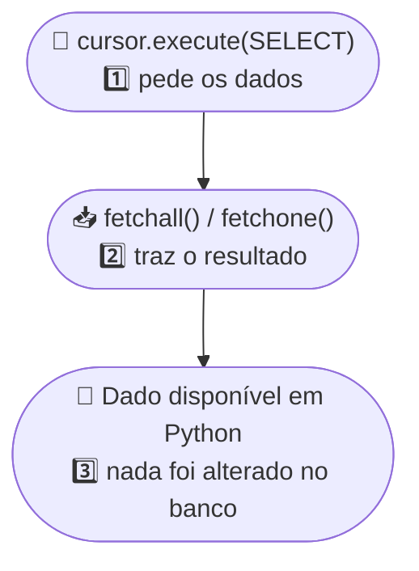
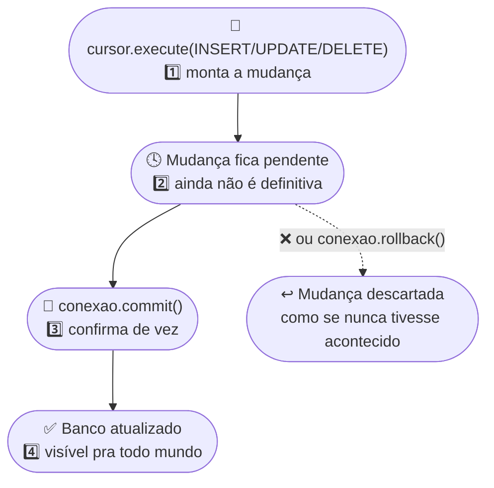

<h1 align="center">
  <span style="color:#306998;">CRUD</span> em Python — <br>
  <span style="color:#FFD43B;">Create · Read · Update · Delete</span> 
</h1>

<p align="center">
  Guia de referência do <b>Módulo 20 — Python + SQL</b>: as quatro operações que sustentam qualquer sistema com banco de dados, aplicadas via <code>pyodbc</code> (SQL Server) e comparadas com <code>mysql-connector-python</code> (MySQL).
  <br><br>
     
  <br><br>
   
   
   
  
</p>

<h2 align="left">📋 Conteúdo: </h2>

1. [O que é CRUD](#-1-o-que-é-crud)
2. [➕ Create — Criando Tabela e Registros](#-2--create--criando-tabela-e-registros)
3. [📖 Read — Lendo os Dados](#-3--read--lendo-os-dados)
4. [✏️ Update — Alterando Registros](#-4--update--alterando-registros)
5. [🗑️ Delete — Apagando Registros](#-5--delete--apagando-registros)
6. [🗺️ Modelagem Visual — Leitura × Escrita](#-6-modelagem-visual--leitura--escrita)
7. [🆚 CRUD em MySQL — Mesmo Padrão, Outro Dialeto](#-7-crud-em-mysql--mesmo-padrão-outro-dialeto)
8. [🧾 Resumo do CRUD](#-8-resumo-do-crud)

<h2 align="left">🧩 1. O que é CRUD? </h2>

**CRUD** é o acrônimo das quatro operações que qualquer sistema faz sobre um dado guardado: **C**reate, **R**ead, **U**pdate, **D**elete. Todo `INSERT`/`SELECT`/`UPDATE`/`DELETE` que se escreve em SQL — não importa o banco — se encaixa em uma dessas quatro letras.

| Letra 🔑 | Operação 🔓 | Comando SQL 🔓 | Método `pyodbc` 🔓 |
|---|---|---|---|
| ➕ **C** | Create | `INSERT INTO` | `execute()` / `executemany()` + `commit()` |
| 📖 **R** | Read | `SELECT` | `execute()` + `fetchall()` / `fetchone()` |
| ✏️ **U** | Update | `UPDATE ... SET ... WHERE` | `execute()` + `commit()` |
| 🗑️ **D** | Delete | `DELETE FROM ... WHERE` | `execute()` + `commit()` |

Os exemplos abaixo usam uma tabela `Vendas` (`Produto`, `Categoria`, `Quantidade`, `ValorUnitario`, `DataVenda`, `Vendedor`), conectada via `conexao.py`:

```python
from conexao import nova_conexao_sqlserver

conexao = nova_conexao_sqlserver(banco="HashtagCursoSQL")
cursor = conexao.cursor()
```

<h2 align="left">➕ 2. Create — Criando Tabela e Registros</h2>

O "C" do CRUD: criar a estrutura da tabela e inserir os primeiros registros.

<h3 align="left">🏗️ CREATE TABLE</h3>

`IDENTITY(1,1)` faz o `Id` se auto-incrementar — não precisa ser informado nos `INSERT`s.

| Coluna 🔑 | Tipo 🔓 | Papel 🔓 |
|---|---|---|
| `Id` | `INT IDENTITY` | Chave primária, gerada sozinha |
| `Produto` | `VARCHAR(100)` | Nome do produto vendido |
| `Categoria` | `VARCHAR(50)` | Categoria do produto |
| `Quantidade` | `INT` | Unidades vendidas |
| `ValorUnitario` | `DECIMAL(10,2)` | Preço de cada unidade |
| `DataVenda` | `DATE` | Data em que a venda aconteceu |
| `Vendedor` | `VARCHAR(100)` | Quem fez a venda |

```python
cursor.execute("""
IF OBJECT_ID('dbo.Vendas', 'U') IS NOT NULL
    DROP TABLE dbo.Vendas;

CREATE TABLE dbo.Vendas (
    Id INT IDENTITY(1,1) PRIMARY KEY,
    Produto VARCHAR(100) NOT NULL,
    Categoria VARCHAR(50) NOT NULL,
    Quantidade INT NOT NULL,
    ValorUnitario DECIMAL(10,2) NOT NULL,
    DataVenda DATE NOT NULL,
    Vendedor VARCHAR(100) NOT NULL
);
""")
conexao.commit()
```

<h3 align="left">➕ INSERT — uma linha por vez</h3>

Um `?` por coluna, com os valores na mesma ordem como argumentos de `execute()`.

```python
cursor.execute(
    """INSERT INTO dbo.Vendas
    (Produto, Categoria, Quantidade, ValorUnitario, DataVenda, Vendedor)
    VALUES (?, ?, ?, ?, ?, ?)""",
    "Notebook Gamer", "Eletrônicos", 2, 4500.00, "2026-01-05", "Ana Souza"
)
conexao.commit()
```

<h3 align="left">📚 INSERT — várias linhas com `executemany`</h3>

| Método 🔑 | Quando usar 🔓 |
|---|---|
| `cursor.execute(sql, valores)` | Uma linha |
| `cursor.executemany(sql, lista_de_tuplas)` | Várias linhas de uma vez — mais rápido que `execute()` em loop |

```python
novas_vendas = [
    ("Mouse sem Fio", "Eletrônicos", 5, 89.90, "2026-01-06", "Bruno Lima"),
    ("Cadeira Gamer", "Móveis", 1, 1299.00, "2026-01-06", "Ana Souza"),
    ("Monitor 27\"", "Eletrônicos", 3, 1199.00, "2026-01-07", "Carla Dias"),
]

cursor.executemany(
    """INSERT INTO dbo.Vendas
    (Produto, Categoria, Quantidade, ValorUnitario, DataVenda, Vendedor)
    VALUES (?, ?, ?, ?, ?, ?)""", novas_vendas
)
conexao.commit()
```

<h2 align="left">📖 3. Read — Lendo os Dados</h2>

O "R" do CRUD: ler os dados de várias formas — tudo de uma vez, linha a linha, filtrando e ordenando.

<h3 align="left">📋 SELECT * — trazendo tudo</h3>

Cada linha devolvida por `fetchall()` é um objeto `pyodbc.Row`, acessável por índice (`linha[0]`) ou pelo nome da coluna (`linha.Produto`).

```python
cursor.execute("SELECT * FROM dbo.Vendas")
todas_as_vendas = cursor.fetchall()

for indice_venda, venda in enumerate(todas_as_vendas):
    print(f"#{venda.Id} {venda.Produto} — {venda.Quantidade}x R${venda.ValorUnitario}")
```

<h3 align="left">🔁 `fetchone()` × `fetchall()` × iterar o cursor</h3>

| Forma 🔑 | Comportamento 🔓 |
|---|---|
| `cursor.fetchall()` | traz tudo de uma vez, numa lista — ocupa memória proporcional ao tamanho do resultado |
| `cursor.fetchone()` | traz **uma linha por chamada** — útil quando o resultado é gigante e não cabe todo na memória |
| `for linha in cursor:` | itera direto no cursor, uma linha por vez, sem guardar tudo numa lista |

### 🔍 Filtrando com `WHERE`

Os valores continuam entrando como parâmetro (`?`), nunca concatenados na string.

| Operador 🔑 | Exemplo 🔓 |
|---|---|
| `=` | `WHERE Categoria = ?` |
| `>` / `<` | `WHERE ValorUnitario > ?` |
| `LIKE` | `WHERE Produto LIKE ?` (com `%` como coringa) |

```python
cursor.execute(
    "SELECT Produto, Categoria, ValorUnitario FROM dbo.Vendas WHERE Categoria = ?",
    "Eletrônicos"
)
eletronicos = cursor.fetchall()
```

### 🔢 Ordenando com `ORDER BY`

```python
cursor.execute("SELECT Produto, ValorUnitario FROM dbo.Vendas ORDER BY ValorUnitario DESC")
vendas_ordenadas = cursor.fetchall()
```

### 🐼 Read para análise — `pandas.read_sql`

Quando o objetivo é **analisar** (agrupar, somar, cruzar colunas), `pd.read_sql()` recebe a conexão já aberta e devolve o resultado direto como `DataFrame`, sem percorrer `fetchall()` na mão.

| Parâmetro 🔑 | Papel 🔓 |
|---|---|
| `sql` | o comando `SELECT` (ou nome de uma tabela) |
| `con` | a conexão já aberta |
| `params` | valores que substituem os `?` do SQL — mesma lógica segura de parâmetro |

```python
import pandas as pd

df_vendas = pd.read_sql("SELECT * FROM dbo.Vendas;", conexao)

df_moveis = pd.read_sql(
    "SELECT Produto, Quantidade, ValorUnitario FROM dbo.Vendas WHERE Categoria = ?",
    conexao, params=["Móveis"]
)

df_vendas["Total"] = df_vendas["Quantidade"] * df_vendas["ValorUnitario"]
faturamento_por_categoria = df_vendas.groupby("Categoria")["Total"].sum()
```

## ✏️ 4. Update — Alterando Registros

O "U" do CRUD: alterar linhas que já existem, sempre com `UPDATE ... SET ... WHERE`. O `WHERE` aqui é ainda mais crítico que no `SELECT` — sem ele, o `UPDATE` altera **a tabela inteira**.

### 🎯 UPDATE de um único registro

Filtrando por `Id` (a chave primária), o `UPDATE` atinge exatamente uma linha.

| Cláusula 🔑 | Papel 🔓 |
|---|---|
| `SET coluna = ?` | qual valor muda |
| `WHERE Id = ?` | qual linha muda |

```python
cursor.execute(
    "UPDATE dbo.Vendas SET ValorUnitario = ? WHERE Id = ?",
    79.90, id_da_venda
)
conexao.commit()
```

### 📦 UPDATE em massa com `WHERE`

Qualquer condição que bata com várias linhas faz o `UPDATE` valer pra todas elas de uma vez.

```python
cursor.execute(
    "UPDATE dbo.Vendas SET Vendedor = ? WHERE Vendedor = ?",
    "Ana Souza Ferreira", "Ana Souza"
)
conexao.commit()

print(f"{cursor.rowcount} linhas atualizadas")
```

> ⚠️ **Regra prática:** antes de qualquer `UPDATE`/`DELETE` com `WHERE`, rode um `SELECT COUNT(*) ... WHERE` com a mesma condição. Se o número bater com o esperado, aí sim execute o `UPDATE`/`DELETE` de verdade.

## 🗑️ 5. Delete — Apagando Registros

O "D" do CRUD, e o mais irreversível dos quatro: `DELETE FROM ... WHERE` apaga a linha de verdade — sem lixeira, sem "desfazer".

### 🔎 Conferindo antes de apagar

```python
cursor.execute("SELECT Id, Produto, Categoria FROM dbo.Vendas WHERE Produto = ?", "Luminária de Mesa")
linha_a_apagar = cursor.fetchone()
```

### 🗑️ DELETE de um registro

```python
cursor.execute("DELETE FROM dbo.Vendas WHERE Id = ?", linha_a_apagar.Id)
conexao.commit()

print(f"{cursor.rowcount} linha apagada.")
```

### 📦 DELETE com condição mais ampla

Assim como no `UPDATE`, o `WHERE` de um `DELETE` pode atingir várias linhas de uma vez — por isso o `SELECT COUNT(*)` de conferência é ainda mais importante aqui.

```python
cursor.execute("SELECT COUNT(*) AS Total FROM dbo.Vendas WHERE Quantidade < ?", 2)
quantas_seriam_apagadas = cursor.fetchone().Total

cursor.execute("DELETE FROM dbo.Vendas WHERE Quantidade < ?", 2)
conexao.commit()
```

## 🗺️ 6. Modelagem Visual — Leitura × Escrita

<h3 align="center">📖 Fluxo de uma operação de Leitura (Read)</h3>



<h3 align="center">✏️🗑️➕ Fluxo de uma operação de Escrita (Create · Update · Delete)</h3>



> 🧠 A diferença central: **Read não muda nada**, então não precisa de `commit()` — o dado só viaja do banco pro Python. Já **Create, Update e Delete alteram o estado do banco**, e ficam pendentes até um `commit()` explícito (ou são desfeitos com `rollback()`). É por isso que só as três últimas letras do CRUD aparecem sempre acompanhadas de `conexao.commit()`.

---

## 🆚 7. CRUD em MySQL — Mesmo Padrão, Outro Dialeto

Tudo feito com SQL Server via `pyodbc` tem equivalente direto em **MySQL**, com uma biblioteca própria (`mysql-connector-python`) e sintaxe SQL quase idêntica.

| Aspecto 🔑 | pyodbc + SQL Server 🔓 | mysql-connector-python 🔓 |
|---|---|---|
| Conectar | `pyodbc.connect(string_de_conexao)` | `mysql.connector.connect(host=..., user=..., password=...)` |
| Parâmetro seguro | `?` | `%s` |
| Auto-incremento | `IDENTITY(1,1)` | `AUTO_INCREMENT` |
| Criar banco | passo separado (`CREATE DATABASE` fora da conexão) | `CREATE DATABASE IF NOT EXISTS ...` direto na conexão |

```python
import mysql.connector
from conexao import nova_conexao_mysql

conexao = nova_conexao_mysql()
cursor = conexao.cursor()

cursor.execute("CREATE DATABASE IF NOT EXISTS HashtagCursoSQL")
conexao.database = "HashtagCursoSQL"

# Create
cursor.execute("DROP TABLE IF EXISTS Clientes")
cursor.execute("""
CREATE TABLE Clientes (
    Id INT AUTO_INCREMENT PRIMARY KEY,
    Nome VARCHAR(100) NOT NULL,
    Email VARCHAR(100) NOT NULL,
    Cidade VARCHAR(50) NOT NULL,
    DataCadastro DATE NOT NULL
)
""")
cursor.executemany(
    "INSERT INTO Clientes (Nome, Email, Cidade, DataCadastro) VALUES (%s, %s, %s, %s)",
    clientes
)
conexao.commit()

# Read
cursor.execute("SELECT Id, Nome, Cidade FROM Clientes WHERE Cidade = %s", ("Recife",))
clientes_recife = cursor.fetchall()

# Update
cursor.execute("UPDATE Clientes SET Cidade = %s WHERE Nome = %s", ("Olinda", "Marina Torres"))
conexao.commit()

# Delete
cursor.execute("DELETE FROM Clientes WHERE Nome = %s", ("Rafael Costa",))
conexao.commit()

cursor.close()
conexao.close()
```

> 💡 É a **portabilidade de conceito**, mais do que de código, que faz valer a pena aprender o padrão CRUD uma vez e reaplicar em qualquer banco relacional. Ver [PYODBC.md](PYODBC.md) para os detalhes da conexão em si.

---

## 🧾 8. Resumo do CRUD

| Operação 🔑 | Comando SQL 🔓 | Método `pyodbc` 🔓 | Método MySQL 🔓 | Precisa de `commit()`? 🔓 |
|---|---|---|---|---|
| ➕ Create | `INSERT INTO` | `execute()` / `executemany()` | `execute()` / `executemany()` | ✅ Sim |
| 📖 Read | `SELECT` | `fetchall()` / `fetchone()` | `fetchall()` / `fetchone()` | ❌ Não |
| ✏️ Update | `UPDATE ... SET ... WHERE` | `execute()` | `execute()` | ✅ Sim |
| 🗑️ Delete | `DELETE FROM ... WHERE` | `execute()` | `execute()` | ✅ Sim |

<p align="center">
  📓 Baseado nos notebooks <code>136</code> a <code>140</code> e <code>149</code> do <a href="../ipynb/">Módulo 20 — Python + SQL</a>.
</p>
