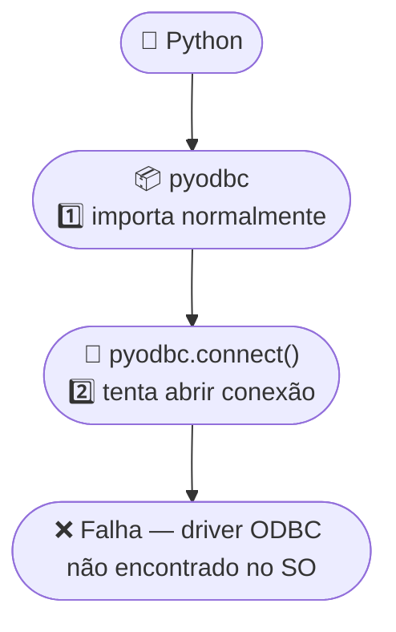
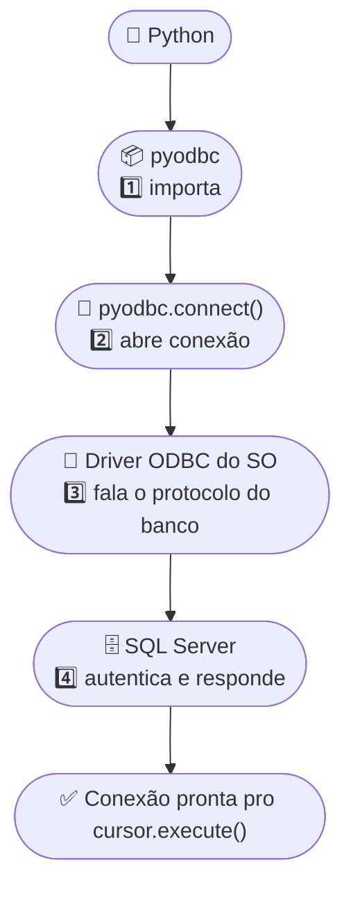

<h1 align="center">
  <span style="color:#306998;">pyodbc</span> — <br>
  <span style="color:#FFD43B;">Conectando Python ao SQL Server</span> 
  
</h1>

<p align="center">
  Guia de referência do <b>Módulo 20 — Python + SQL</b>: o que é <code>pyodbc</code>, como instalar as duas peças necessárias, como montar a string de conexão e os cuidados antes do primeiro <code>CREATE</code>/<code>UPDATE</code>/<code>DELETE</code> de verdade.
  <br><br>
   
   
   
  
</p>

## 📋 Conteúdo

1. [Arquivo vs. Banco de Dados](#-1-arquivo-vs-banco-de-dados)
2. [As Duas Instalações Necessárias](#-2-as-duas-instalações-necessárias)
3. [Instalando por Sistema Operacional](#-3-instalando-por-sistema-operacional)
4. [Verificando os Drivers ODBC Instalados](#-4-verificando-os-drivers-odbc-instalados)
5. [Montando a String de Conexão](#-5-montando-a-string-de-conexão)
6. [Primeira Conexão de Verdade](#-6-primeira-conexão-de-verdade)
7. [🗺️ Modelagem Visual — Sem Driver × Com Driver](#-7-modelagem-visual--sem-driver--com-driver)
8. [Boas Práticas de Conexão](#-8-boas-práticas-de-conexão)
9. [Subindo o Banco com Docker](#-9-subindo-o-banco-com-docker)
10. [pyodbc × mysql-connector-python](#-10-pyodbc--mysql-connector-python)

---

## 📁 1. Arquivo vs. Banco de Dados

Até este módulo, todo dado que o Python lia ou salvava morava num arquivo (Excel, CSV, PDF, txt...). Um **banco de dados** é outro jeito de guardar informação — pensado pra quando muita gente (ou muitos programas) precisa ler e escrever ao mesmo tempo, com segurança e sem bagunçar os dados.

| Situação 🔑 | Arquivo (Excel/CSV) 🔓 | Banco de Dados 🔓 |
|---|---|---|
| Duas pessoas editando ao mesmo tempo | Trava, sobrescreve, gera conflito | Escreve linha a linha, sem sobrescrever o trabalho de ninguém |
| Volume de dados (milhões de linhas) | Fica lento, pode nem abrir | Continua rápido, feito pra isso |
| Vários sistemas usando o mesmo dado | Cada um com uma cópia desatualizada | Todo mundo lê/escreve na mesma fonte, sempre atual |
| Consistência dos dados | Depende de quem digitou certo | O próprio banco valida tipo, obrigatoriedade, duplicidade |
| Rodar 24h em produção | Não foi feito pra isso | É exatamente o que ele faz |

> 💡 **Resumindo:** arquivo é ótimo pra análise pontual e pra compartilhar um resultado. Banco de dados é a peça que fica por trás de um sistema, recebendo e entregando dado o tempo todo.

O banco de dados roda como um **servidor** separado — um programa próprio, ligado o tempo todo, esperando conexões numa porta de rede (`1433` no SQL Server, `3306` no MySQL). O Python não lê o banco como lê um arquivo: ele **se conecta** nesse servidor e conversa através de um driver.

| Peça 🔑 | Papel 🔓 |
|---|---|
| Servidor de banco de dados | Programa que guarda os dados de verdade e responde a pedidos |
| Driver (`pyodbc`) | Biblioteca Python que sabe "falar" o protocolo do banco |
| Conexão | Canal aberto entre o Python e o servidor, autenticado com usuário/senha |
| Cursor | Objeto que percorre a conexão pra executar comandos e buscar resultados |
| SQL | A linguagem universal usada pra pedir/alterar dados dentro do banco |

O fluxo básico é sempre o mesmo: **conectar → executar um comando SQL → ler o resultado (se houver) → confirmar mudanças (`commit`) → fechar a conexão**.

---

## 🧩 2. As Duas Instalações Necessárias

`pyodbc` sozinho não conecta em nada — ele é só a ponte. Quem realmente sabe falar o protocolo do SQL Server é o **driver ODBC**, instalado no sistema operacional (não com `pip`).

| Peça 🔑 | O que é 🔓 | Como instala 🔓 |
|---|---|---|
| `pyodbc` | Biblioteca Python que usa a interface ODBC | `pip install pyodbc` |
| Driver ODBC do SQL Server | Componente do sistema que sabe o protocolo do SQL Server | Windows: instalador da Microsoft · Mac/Linux: `unixodbc` + `msodbcsql` |

> ⚠️ **Atenção:** em Mac e Linux, sem o driver ODBC instalado no sistema, `pyodbc` importa normalmente mas **toda tentativa de conexão falha**. É o erro mais comum de quem começa com `pyodbc` fora do Windows.

---

## 📦 3. Instalando por Sistema Operacional

A biblioteca Python é igual nas três OS:

```bash
pip install pyodbc
```

O driver ODBC do SQL Server, porém, é instalado à parte em cada sistema:


Baixe e rode o instalador **"ODBC Driver for SQL Server"** direto no [site da Microsoft](https://learn.microsoft.com/sql/connect/odbc/download-odbc-driver-for-sql-server).


Via `apt`, adicionando o repositório oficial da Microsoft e instalando o `msodbcsql18`:

```bash
curl https://packages.microsoft.com/keys/microsoft.asc | sudo tee /etc/apt/trusted.gpg.d/microsoft.asc
curl https://packages.microsoft.com/config/ubuntu/22.04/prod.list | sudo tee /etc/apt/sources.list.d/mssql-release.list
sudo apt-get update
sudo ACCEPT_EULA=Y apt-get install -y msodbcsql18 unixodbc-dev
```


Via Homebrew (a Microsoft publica um "tap" próprio):

```bash
brew tap microsoft/mssql-release https://github.com/Microsoft/homebrew-mssql-release
HOMEBREW_ACCEPT_EULA=Y ACCEPT_EULA=Y brew install unixodbc msodbcsql18
```

---

## 🔍 4. Verificando os Drivers ODBC Instalados

Antes de tentar conectar, vale confirmar que o sistema enxerga o driver — `pyodbc.drivers()` lista tudo o que está registrado no ODBC do sistema operacional.

| Método 🔑 | O que faz 🔓 |
|---|---|
| `pyodbc.drivers()` | devolve a lista de drivers ODBC instalados no sistema |

```python
import pyodbc as py

drivers_instalados = py.drivers()

print("Drivers ODBC encontrados:")
for driver in drivers_instalados:
    print(f"  - {driver}")
```

---

## 🧵 5. Montando a String de Conexão

`pyodbc.connect()` recebe uma única string, com pares `chave=valor;` separados por `;`.

| Parâmetro 🔑 | Para que serve 🔓 |
|---|---|
| `DRIVER` | Nome exato do driver, entre chaves — igual aparece em `pyodbc.drivers()` |
| `SERVER` | Endereço do servidor (`host,porta` ou `host\instância`) |
| `DATABASE` | Banco de dados dentro do servidor (opcional — sem isso, conecta no banco padrão) |
| `UID` / `PWD` | Usuário e senha |
| `TrustServerCertificate` | `yes` para aceitar certificado autoassinado (comum em ambiente local/Docker) |

```python
string_conexao = (
    "DRIVER={ODBC Driver 18 for SQL Server};"
    "SERVER=localhost,1433;"
    "UID=sa;"
    "PWD=SuaSenhaAqui;"
    "TrustServerCertificate=yes;"
)
```

---

## 🚀 6. Primeira Conexão de Verdade

Com a string pronta, `pyodbc.connect()` abre a conexão. Se não der erro, o servidor aceitou usuário e senha.

```python
conexao = py.connect(string_conexao)
cursor = conexao.cursor()

cursor.execute("SELECT @@VERSION")
versao_servidor = cursor.fetchone()[0]

print("Conectado com sucesso!")
print(versao_servidor.splitlines()[0])

conexao.close()
```

---

## 🗺️ 7. Modelagem Visual — Sem Driver × Com Driver

<h3 align="center">🚫 Sem o driver ODBC instalado</h3>



<h3 align="center">✅ Com o driver ODBC instalado</h3>



> 🧠 `pyodbc` **nunca** fala direto com o SQL Server — ele sempre passa pelo driver ODBC do sistema operacional. É por isso que `import pyodbc` nunca falha (é só Python puro), mas `pyodbc.connect()` falha sem o driver certo instalado: falta a peça do meio.

---

## 🛡️ 8. Boas Práticas de Conexão

Banco de dados é um recurso compartilhado, muitas vezes em produção. Um erro aqui não é "abrir o arquivo errado" — é **derrubar conexão de outras pessoas**, **deixar dado corrompido** ou **vazar credencial**.

<h3 align="left">🔑 8.1 <mark style="background-color: white; color: red">NUNCA</mark> Deixe Credencial no Código</h3>

| Errado ❌ | Certo ✅ |
|---|---|
| `pyodbc.connect("...PWD=minha_senha_real;...")` espalhado em várias células | `from conexao import nova_conexao_sqlserver` |

> 💡 Em um projeto profissional, esse arquivo nem ficaria no Git — as credenciais viriam de variáveis de ambiente ou de um cofre de segredos (Azure Key Vault, AWS Secrets Manager etc.).

<h3 align="left">🔒 8.2 <mark style="background-color: white; color: green">SEMPRE</mark> Feche a Conexão</h3>

| Padrão 🔑 | Por que usar 🔓 |
|---|---|
| `conexao.close()` no final | Garante que o slot é liberado |
| `with pyodbc.connect(...) as conexao:` | Fecha sozinho, mesmo se o código der erro no meio |

```python
with pyodbc.connect(string_conexao) as conexao:
    cursor = conexao.cursor()
    cursor.execute("SELECT 1")
    print(cursor.fetchone())
# a conexão já fechou sozinha aqui fora
```

<h3 align="left">💉 8.3 <mark style="background-color: white; color: red">NUNCA</mark> Monte SQL Concatenando Texto</h3>

| Errado ❌ | Certo ✅ |
|---|---|
| `cursor.execute(f"SELECT * FROM Clientes WHERE Nome = '{nome}'")` | `cursor.execute("SELECT * FROM Clientes WHERE Nome = ?", nome)` |

> ⚠️ **Atenção:** se `nome` fosse literalmente `' OR '1'='1`, a versão concatenada viraria `WHERE Nome = '' OR '1'='1'` — e devolveria a tabela inteira. Com `?`, o valor nunca é interpretado como parte do comando SQL.

<h3 align="left">💾 8.4 Commit <mark style="background-color: white; color: red">NÃO É</mark> Automático</h3>

| Comando 🔑 | O que faz 🔓 |
|---|---|
| `conexao.commit()` | Confirma (grava definitivamente) todas as mudanças pendentes |
| `conexao.rollback()` | Desfaz as mudanças pendentes, como se nunca tivessem acontecido |
| `pyodbc.connect(..., autocommit=True)` | Cada comando já é gravado sozinho, sem precisar de `commit()` manual |

> 💡 **Por que não usar `autocommit=True` sempre?** Porque às vezes você quer que várias mudanças aconteçam **juntas ou nenhuma delas** — se uma falhar no meio, o `rollback()` desfaz tudo, e o banco nunca fica num estado "pela metade".

---

## 🐳 9. Subindo o Banco com Docker

O `SQLSERVER_HOST` de `conexao.py` aponta pra `localhost,1433` — precisa de um SQL Server rodando localmente *antes* da primeira célula. Quem sobe isso é o `docker-compose.yml` da pasta `docker/`, usando a imagem **Azure SQL Edge**.

```bash
# a partir da pasta docker/
docker compose up -d sqlserver

# se o container já existe mas está parado
docker start hashtag-sqlserver
```

| Comando 🔑 | O que faz 🔓 |
|---|---|
| `docker compose up -d sqlserver` | Cria (ou recria) o container `hashtag-sqlserver`, em background |
| `docker start hashtag-sqlserver` | Só liga um container que já existia e foi parado |
| `docker ps` | Confirma se o container está `Up` antes de tentar conectar |

> ⚠️ Se essa etapa for pulada, `nova_conexao_sqlserver()` estoura erro de conexão — o driver não acha ninguém ouvindo em `localhost,1433`.

---

## 🆚 10. pyodbc × mysql-connector-python

Nem todo banco relacional usa ODBC — o MySQL, por exemplo, tem driver Python próprio, sem componente extra do sistema operacional.

| Aspecto 🔑 | pyodbc + SQL Server 🔓 | mysql-connector-python 🔓 |
|---|---|---|
| Instalação | biblioteca Python + driver ODBC do sistema | só `pip install mysql-connector-python` |
| Conectar | `pyodbc.connect(string_de_conexao)` | `mysql.connector.connect(host=..., user=..., password=...)` |
| Parâmetro seguro | `?` | `%s` |
| Auto-incremento | `IDENTITY(1,1)` | `AUTO_INCREMENT` |

O fluxo (conectar → cursor → `execute()` → `commit()`/`fetchall()` → fechar) é o mesmo — só muda o dialeto. Ver [CRUD.md](CRUD.md) para o CRUD completo comparando os dois.

---

<p align="center">
  📓 Baseado nos notebooks <code>132</code> a <code>135</code> do <a href="../ipynb/">Módulo 20 — Python + SQL</a>.
</p>
